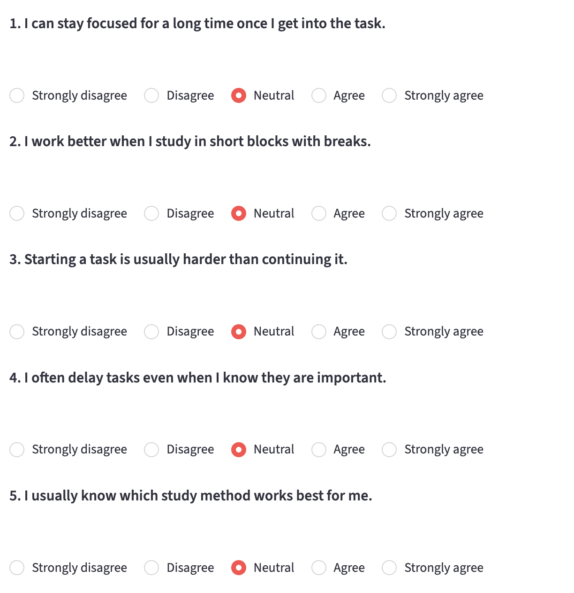
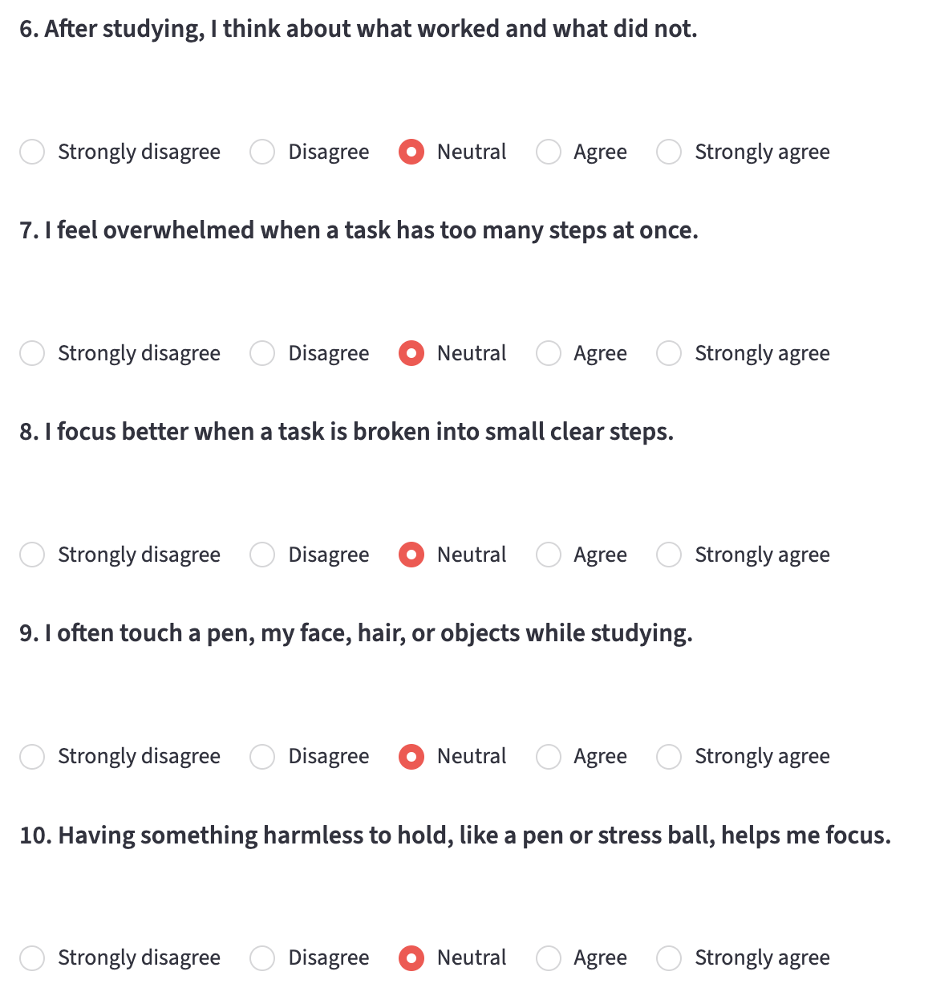
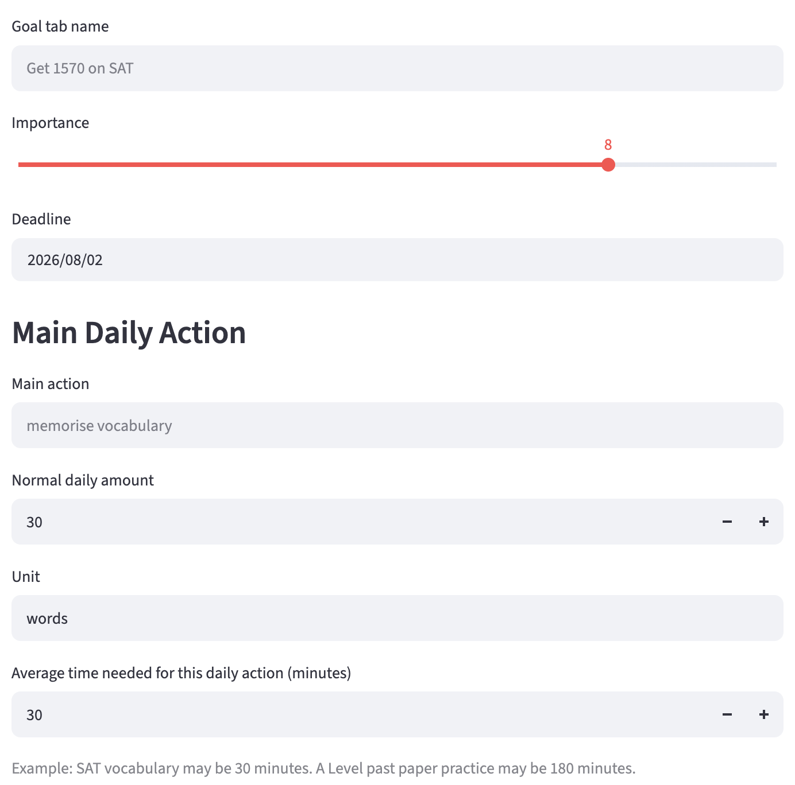
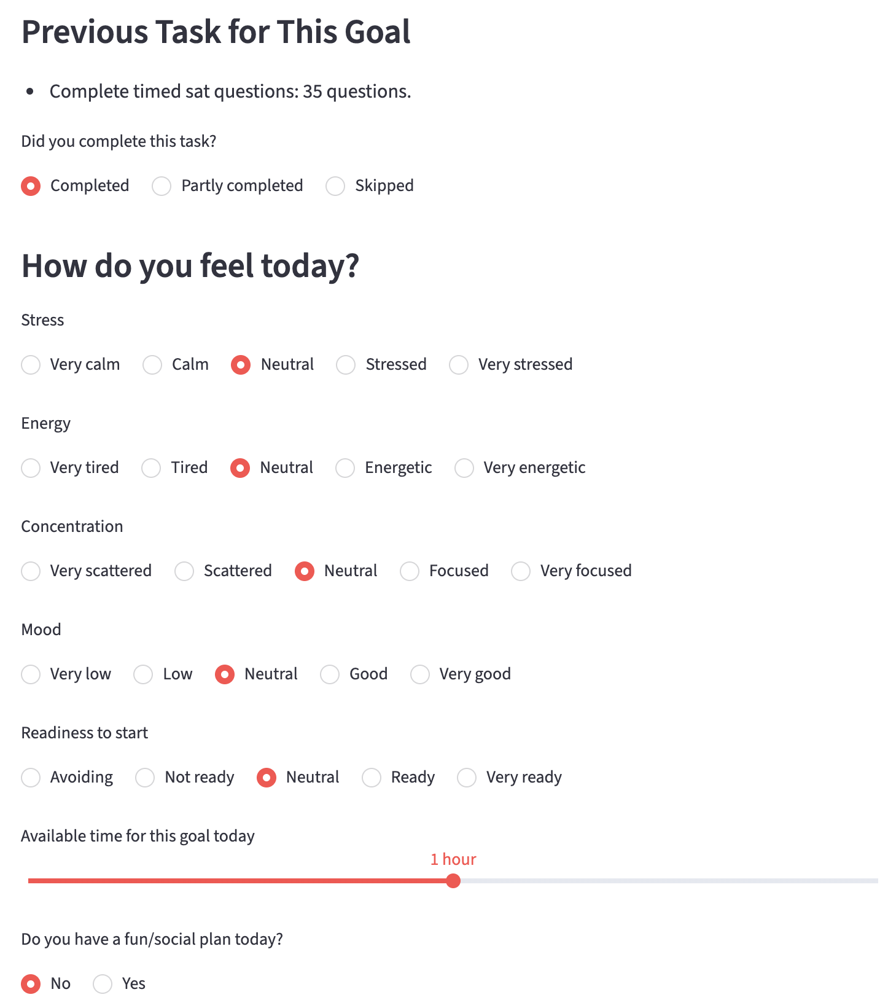

# How to Use Yona's Management Function

## Open the app

Use the hosted Streamlit version in your browser:

**[Open Yona's Management Function](https://self-management-function-8w87ie9dkcxwlbms5abk7m.streamlit.app/)**

If Streamlit shows a sleeping-app screen, wait for the app to wake up and reload the page if necessary.

## Quick start

The normal workflow is:

```text
Study Style Test → Add a goal → Daily Check-In → Follow today's task
                                      ↓
                         Check Progress / History
```

The hosted app opens in **read-only visitor mode**. Visitors can review the owner's
goals, progress, history, study profile, and YMF explanation, but cannot save or
delete anything. The owner can unlock editing from **Owner access** in the sidebar
using the password configured in Streamlit Secrets. Lock editing again when finished,
especially on a shared device.

## 1. Create your Study Style Profile

On your first visit, the app opens the **Study Style Test** automatically.

1. Answer the 10 questions from **Strongly disagree** to **Strongly agree**.
2. Select **Create Study Style Profile**.
3. Review your focus style, profile scores, and recommended study method under **Study Style Profile**.

The profile helps the app adjust task size, task structure, and execution advice. It is a planning aid, not a clinical or diagnostic test. You can take the test again later by opening **Study Style Profile** from the sidebar and selecting **Retake Study Style Test**.





## 2. Add an academic goal

Select **Add New Goal** on the home screen and enter:

- **Goal tab name** — for example, `Get 1570 on SAT`.
- **Importance** — from 1 to 10.
- **Deadline** — the target completion date.
- **Main action** — the repeated action that moves the goal forward, such as `memorise vocabulary`.
- **Normal daily amount** — the amount you would normally complete.
- **Unit** — for example, `words`, `questions`, `minutes`, or `pages`.
- **Average time needed** — the usual number of minutes required for that daily action.

Select **Add Goal Tab** to save it. Create separate tabs for goals with different deadlines or daily actions.



## 3. Complete a Daily Check-In

Select **Daily Check-In** and follow these steps:

1. Choose one goal to work on today.
2. From the second check-in onward, report whether the previous task was **Completed**, **Partly completed**, or **Skipped**.
3. Rate today's stress, energy, concentration, mood, and readiness to start.
4. Choose how much time is available for this goal.
5. Optionally enter a fun or social plan that the study plan should take into account.
6. Select **Generate Today's Plan for This Goal**.



The app returns:

- Today's mode: **LOCK IN**, **STEADY**, **MINIMUM**, **RECOVERY**, or **CATCH-UP**.
- A specific task amount.
- Advice on how to carry out the task.
- An explanation and relaxation advice.
- Goal Pressure, Time Fit, Capacity, Burnout Risk, and adjustment values.

Treat the result as a realistic planning recommendation. Adjust or stop the task when your health, safety, or circumstances require it.

## 4. Report completion and update progress

Completion is recorded when you return to the same goal for its next check-in:

| Previous task result | Estimated progress added |
| --- | ---: |
| Completed | +1.0% |
| Partly completed | +0.4% |
| Skipped | +0% |

Estimated progress is a consistency signal, not a measurement of academic mastery or final results.

## 5. Review your goals and results

Use the sidebar menu to open:

- **Home** — start a check-in, add a goal, or see current goal summaries.
- **View Goal Tabs** — review importance, deadlines, daily actions, and expected study time.
- **Check Progress** — see total integrated effort, average daily effort, the highest effort day, a secondary consistency score, and recent completion evidence for each goal.
- **History** — review the 15 most recent check-ins, recommended modes, tasks, and function values.
- **Study Style Profile** — review recommendations or retake the test.
- **What is YMF(x)?** — read how the planning function works.

## 6. Delete or restart a goal

Open **Delete Goal Tab**, choose the goal, and select **Delete Goal Tab**.

Deletion cannot be undone. It removes the goal and its latest saved task state. If you want to restart a completed goal, delete it and create a new goal tab.

## Public viewing and privacy

The hosted app is a personal progress page without public accounts. Only the owner can write after entering the owner password; everyone else has read-only access. The implementation still saves the owner's goals, profile data, state, and history in files used by the deployed app.

- Do not put names, contact details, school records, health information, passwords, or other sensitive data in goal or check-in fields.
- Data entered by the owner may be visible to visitors, so it should still be treated as public.
- Data may be reset when the hosted app restarts or is redeployed.
- Do not rely on the hosted version as permanent storage or as your only copy of important information.

For private testing, run the app locally by following the installation instructions in the [README](README.md).

## Troubleshooting

- **The app starts with the Study Style Test:** this is expected when no profile has been saved yet.
- **Daily Check-In has no selectable goal:** add a goal first. Goals that reach 100% are no longer offered as active check-in goals.
- **No progress appears after the first plan:** progress is applied when you report that plan's completion during the next check-in for the same goal.
- **The app has reset:** the hosted Streamlit instance may have restarted; recreate the profile and goal if needed.
- **The sidebar is hidden on a small screen:** use Streamlit's menu control in the upper-left corner to expand it.
